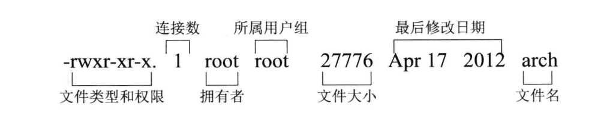
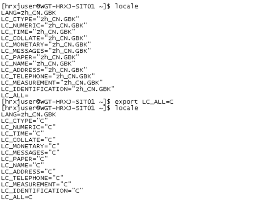
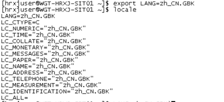

# 三剑客（awk、sed、grep）

## awk

​	awk是一个强大的文本分析工具，简单来说awk就是把文件逐行读入，（空格，制表符）为默认分隔符将每行切片，切开的部分再进行各种分析处理。

```shell
awk [-F field-separator] 'commands' input-file(s)
```

​	[-F 分隔符]是可选的，因为awk使用空格，制表符作为缺省的字段分隔符，因此如果要浏览字段间有空格，制表符的文本，不必指定这个选项，但如果要浏览诸如/etc/passwd文件，此文件各字段以冒号作为分隔符，则必须指明-F选项，例如：

```shell
[root@iZbp1jd5ee7h52j00jed2wZ ~]# echo "this, is, a test"|awk -F , '{print $2}'
 is
[root@iZbp1jd5ee7h52j00jed2wZ ~]# echo "this, is, a test"|awk -F , '{print $3}'
 a test
```

​	shell读取用户输入的字符串发现|，代表有管道。|左右被理解为简单[命令](https://www.linuxcool.com/)，即前一个（左边）简单命令的标准输出指向后一个（右边）标准命令的标准输入
​	awk会根据分隔符将行分成若干个字段，$0为整行，$1为第一个字段，$2 为第2个地段，依此类推…为打印一个字段或所有字段，使用print命令。这是一个`awk`动作：

```shell
echo "this is a test" | awk '{ print $1 }'  
## 输出为  
this  
echo "this is a test" | awk '{ print $1, $2 }'  
## 输出为  
this is
```

### 案例

创建一个passwd文件，用来我们学习awk案例，文件如下：

```shell
root:x:0:0:root:/root:/bin/bash  
bin:x:1:1:bin:/bin:/sbin/nologin  
daemon:x:2:2:daemon:/sbin:/sbin/nologin  
adm:x:3:4:adm:/var/adm:/sbin/nologin  
lp:x:4:7:lp:/var/spool/lpd:/sbin/nologin
```

* **只显示/etc/passwd的账户：**

```shell
[root@iZbp1jd5ee7h52j00jed2wZ linux-study]# awk -F : ' {print $1}' password 
root
bin
daemon
adm
lp
```

* **显示/etc/passwd的第1列和第7列，用逗号分隔显示，所有行开始前添加列名start1，start7，最后一行添加，end1，end7（学到了BEGIN和END的用法）**
  * 注意点1：$1和$7在" "号外
  * 注意点2：BEGIN和 END都是大写

```shell
[root@iZbp1jd5ee7h52j00jed2wZ linux-study]# awk -F ':' 'BEGIN {print"start1,start7"} \
{print $1","$7} END {print "End1,End7"}' password 
start1,start7
root,/bin/bash  
bin,/sbin/nologin  
daemon,/sbin/nologin  
adm,/sbin/nologin  
lp,/sbin/nologin
End1,End7
```

* **统计/etc/passwd文件中，每行的行号，每行的列数，对应的完整行内容(NR是行号，NF是列数)**

```shell
[root@iZbp1jd5ee7h52j00jed2wZ linux-study]# awk -F : '{print NR " " NF " "$0 }' password 
1 7 root:x:0:0:root:/root:/bin/bash  
2 7 bin:x:1:1:bin:/bin:/sbin/nologin  
3 7 daemon:x:2:2:daemon:/sbin:/sbin/nologin  
4 7 adm:x:3:4:adm:/var/adm:/sbin/nologin  
5 7 lp:x:4:7:lp:/var/spool/lpd:/sbin/nologin
```

* **将`/etc/passwd`的用户名变成大写输出(toupper)**

```shell
[root@iZbp1jd5ee7h52j00jed2wZ linux-study]# awk -F ':' '{print toupper($1)}' password 
ROOT
BIN
DAEMON
ADM
LP
```

* 显示/etc/passwd中有var的行

```shell
[root@iZbp1jd5ee7h52j00jed2wZ linux-study]# awk -F ':' '$0 ~ /var/' password
adm:x:3:4:adm:/var/adm:/sbin/nologin  
lp:x:4:7:lp:/var/spool/lpd:/sbin/nologin
```

* 每一行的长度

```shell
* [root@iZbp1jd5ee7h52j00jed2wZ linux-study]# awk -F ':' ' {print length($0)}' password 
  33
  34
  41
  38
  40
```

可以用的语句：if while do/while for break continue

* 输出第一个字段的第一个字符大于d的行

```shell
[root@iZbp1jd5ee7h52j00jed2wZ linux-study]# awk -F ':' '{if($1>"d"){print $1}else{print "--"}}' password 
root
--
daemon
--
lp
```

* 把上面的语句写入脚本中，可以用awk使用
  * 脚本语句

```shell
{   
    if ($1 > "d") {  
        print $1   
    } else {  
        print "-"   
    }   
}
```

使用语句：

```shell
[root@iZbp1jd5ee7h52j00jed2wZ linux-study]# awk -F ':' -f password.sh password
root
-
daemon
-
lp
```


### 支持的内置变量

​	上面示例中`NR`，和`NF`其实就是`awk`的内置变量，一些内置变量如下：

```
变量名 解释
FILENAMEawk浏览的文件名
FS设置输入字段分隔符，等价于命令行-F选项
NF 浏览记录的字段个数
NR 已读的记录数
```

### 支持函数

* **输出字符串的长度(length)**

```shell
[root@iZbp1jd5ee7h52j00jed2wZ linux-study]# awk 'BEGIN{print length("this is a test ")}'
15
```

* **将`/etc/passwd`的全部语句变成大写输出(toupper)**

```shell
[root@iZbp1jd5ee7h52j00jed2wZ linux-study]# awk -F ':' '{print toupper($0)}' password 
ROOT:X:0:0:ROOT:/ROOT:/BIN/BASH  
BIN:X:1:1:BIN:/BIN:/SBIN/NOLOGIN  
DAEMON:X:2:2:DAEMON:/SBIN:/SBIN/NOLOGIN  
ADM:X:3:4:ADM:/VAR/ADM:/SBIN/NOLOGIN  
LP:X:4:7:LP:/VAR/SPOOL/LPD:/SBIN/NOLOGIN
```

常用函数：

```shell
函数名 作用
toupper(s)返回s的大写
tolower(s) 返回s的小写
length(s) 返回s长度
substr(s,p) 返回字符串s中从p开始的后缀部分
```

### 正则表达式

​	常用正则表达式：

```shell
操作符	描述
<  小于 < = 小于等于 == 等于 != 不等于 ~ 匹配正则表达式 !~ 不匹配正则表达式 
```

* 显示/etc/passwd中有var的行

```shell
[root@iZbp1jd5ee7h52j00jed2wZ linux-study]# awk -F ':' '$0 ~ /var/' password
adm:x:3:4:adm:/var/adm:/sbin/nologin  
lp:x:4:7:lp:/var/spool/lpd:/sbin/nologin
```

### 流程控制语句

可以用的语句：if while do/while for break continue

* 输出第一个字段的第一个字符大于d的行

```shell
[root@iZbp1jd5ee7h52j00jed2wZ linux-study]# awk -F ':' '{if($1>"d"){print $1}else{print "--"}}' password 
root
--
daemon
--
lp
```

#### 执行脚本

* 把上面的语句写入脚本中，可以用awk使用
  * 脚本语句

```shell
{   
    if ($1 > "d") {  
        print $1   
    } else {  
        print "-"   
    }   
}
```

使用语句：

```shell
[root@iZbp1jd5ee7h52j00jed2wZ linux-study]# awk -F ':' -f password.sh password
root
-
daemon
-
lp
```

## sed

​	**sed**是一种流编辑器，它是文本处理中非常好的工具，能够完美的配合正则表达式使用，功能不同凡响。处理时，把当前处理的行存储在临时缓冲区中，称为“模式空间”（pattern space），接着用sed[命令](https://www.linuxcool.com/)处理缓冲区中的内容，处理完成后，把缓冲区的内容送往屏幕。接着处理下一行，这样不断重复，直到文件末尾。文件内容并没有改变，除非你使用重定向存储输出。Sed主要用来自动编辑一个或多个文件，可以将数据行进行替换、删除、新增、选取等特定工作，简化对文件的反复操作，编写转换程序等。

```shell
sed的命令格式：sed [options] 'command' file(s);
sed的脚本格式：sed [options] -f scriptfile file(s);
```

### 选项

ps：（sed的删除默认带-e，不对具体文件进行操作）

```shell
 -e ：直接在命令行模式上进行sed动作编辑，此为默认选项;
 -f ：将sed的动作写在一个文件内，用–f filename 执行filename内的sed动作;
 -i ：直接修改文件内容;
 -n ：只打印模式匹配的行；
 -r ：支持扩展表达式;
 -h或--help：显示帮助；
 -V或--version：显示版本信息。
```

### 具体参数

```shell
 a\ 在当前行下面插入文本;
 i\ 在当前行上面插入文本;
 c\ 把选定的行改为新的文本;
 d 删除，删除选择的行;
 D 删除模板块的第一行;
 s 替换指定字符;
 h 拷贝模板块的内容到内存中的缓冲区;
 H 追加模板块的内容到内存中的缓冲区;
 g 获得内存缓冲区的内容，并替代当前模板块中的文本;
 G 获得内存缓冲区的内容，并追加到当前模板块文本的后面;
 l 列表不能打印字符的清单;
 n 读取下一个输入行，用下一个命令处理新的行而不是用第一个命令;
 N 追加下一个输入行到模板块后面并在二者间嵌入一个新行，改变当前行号码;
 p 打印模板块的行。 P(大写) 打印模板块的第一行;
 q 退出Sed;
 b lable 分支到脚本中带有标记的地方，如果分支不存在则分支到脚本的末尾;
 r file 从file中读行;
 t label if分支，从最后一行开始，条件一旦满足或者T，t命令，将导致分支到带有标号的命令处，或者到脚本的末尾;
 T label 错误分支，从最后一行开始，一旦发生错误或者T，t命令，将导致分支到带有标号的命令处，或者到脚本的末尾;
 w file 写并追加模板块到file末尾;
 W file 写并追加模板块的第一行到file末尾;
 ! 表示后面的命令对所有没有被选定的行发生作用;
 = 打印当前行号;
 # 把注释扩展到下一个换行符以前;
```

### 案例

先把password复制一份到password.sed上：

```shell
cp password password.sed
```

#### 删除

* 删除第二行数据（sed默认使用-e，不改变文件，所以文件没发生改变）

```shell
[root@iZbp1jd5ee7h52j00jed2wZ linux-study]# cat password.sed 
root:x:0:0:root:/root:/bin/bash  
bin:x:1:1:bin:/bin:/sbin/nologin  
daemon:x:2:2:daemon:/sbin:/sbin/nologin  
adm:x:3:4:adm:/var/adm:/sbin/nologin  
lp:x:4:7:lp:/var/spool/lpd:/sbin/nologin

[root@iZbp1jd5ee7h52j00jed2wZ linux-study]# sed '2d' password.sed 
root:x:0:0:root:/root:/bin/bash  
daemon:x:2:2:daemon:/sbin:/sbin/nologin  
adm:x:3:4:adm:/var/adm:/sbin/nologin  
lp:x:4:7:lp:/var/spool/lpd:/sbin/nologin

[root@iZbp1jd5ee7h52j00jed2wZ linux-study]# cat  password.sed 
root:x:0:0:root:/root:/bin/bash  
bin:x:1:1:bin:/bin:/sbin/nologin  
daemon:x:2:2:daemon:/sbin:/sbin/nologin  
adm:x:3:4:adm:/var/adm:/sbin/nologin  
lp:x:4:7:lp:/var/spool/lpd:/sbin/nologin
```

* 对文件进行真正的删除（-i）
  * 这边删除完，我用cp又复制回去会

```shell
[root@iZbp1jd5ee7h52j00jed2wZ linux-study]# sed -i '2d' password.sed 
[root@iZbp1jd5ee7h52j00jed2wZ linux-study]# cat password.sed 
root:x:0:0:root:/root:/bin/bash  
daemon:x:2:2:daemon:/sbin:/sbin/nologin  
adm:x:3:4:adm:/var/adm:/sbin/nologin  
lp:x:4:7:lp:/var/spool/lpd:/sbin/nologin
```

* 删除2~4行数据，删除第二行往后的所有数据

```shell
[root@iZbp1jd5ee7h52j00jed2wZ linux-study]# sed '2,4d' password.sed 
root:x:0:0:root:/root:/bin/bash  
lp:x:4:7:lp:/var/spool/lpd:/sbin/nologin
[root@iZbp1jd5ee7h52j00jed2wZ linux-study]# sed '2,$d' password.sed 
root:x:0:0:root:/root:/bin/bash  
```

#### 增加

* 在第二行后(亦即是加在第三行)加上『drink tea?』字样）add（a是加在后面）

```shell
[root@iZbp1jd5ee7h52j00jed2wZ linux-study]# nl password.sed |sed '2a drink tea '
     1	root:x:0:0:root:/root:/bin/bash  
     2	bin:x:1:1:bin:/bin:/sbin/nologin  
drink tea 
     3	daemon:x:2:2:daemon:/sbin:/sbin/nologin  
     4	adm:x:3:4:adm:/var/adm:/sbin/nologin  
     5	lp:x:4:7:lp:/var/spool/lpd:/sbin/nologin
```

* 那如果是要在第二行前加上drink tea，则使用insert（i是加在后面）

```shell
[root@iZbp1jd5ee7h52j00jed2wZ linux-study]# nl password.sed | sed '2i drink tea'
     1	root:x:0:0:root:/root:/bin/bash  
drink tea
     2	bin:x:1:1:bin:/bin:/sbin/nologin  
     3	daemon:x:2:2:daemon:/sbin:/sbin/nologin  
     4	adm:x:3:4:adm:/var/adm:/sbin/nologin  
     5	lp:x:4:7:lp:/var/spool/lpd:/sbin/nologin
```

* 如果是要增加两行以上，在第二行后面加入两行字，例如『Drink tea or .....』与『drink beer?』（使用换行符\）

```shell
[root@iZbp1jd5ee7h52j00jed2wZ linux-study]# nl password.sed | sed '2a drink tea ......\
> dirnk beer'
     1	root:x:0:0:root:/root:/bin/bash  
     2	bin:x:1:1:bin:/bin:/sbin/nologin  
drink tea ......
dirnk beer
     3	daemon:x:2:2:daemon:/sbin:/sbin/nologin  
     4	adm:x:3:4:adm:/var/adm:/sbin/nologin  
     5	lp:x:4:7:lp:/var/spool/lpd:/sbin/nologin
```

#### 替换与显示

* 将第2-4行的内容取代成为『No 2-4 number』

```shell
[root@iZbp1jd5ee7h52j00jed2wZ linux-study]# nl password.sed |sed '2,4c No 2-4 number'
     1	root:x:0:0:root:/root:/bin/bash  
No 2-4 number
     5	lp:x:4:7:lp:/var/spool/lpd:/sbin/nologin
```

* 只显示2-4行

```shell
[root@iZbp1jd5ee7h52j00jed2wZ linux-study]# nl password.sed |sed -n '2,4p'
     2	bin:x:1:1:bin:/bin:/sbin/nologin  
     3	daemon:x:2:2:daemon:/sbin:/sbin/nologin  
     4	adm:x:3:4:adm:/var/adm:/sbin/nologin  
```

* 替换指定字符串
  * 把root替换成user

```
sed 's/root/user'
```

#### 搜索

* 搜索带root的行（如果只要匹配行，则可以加上-n）

```shell
[root@iZbp1jd5ee7h52j00jed2wZ linux-study]# nl password.sed |sed   '/root/p'
     1	root:x:0:0:root:/root:/bin/bash  
     1	root:x:0:0:root:/root:/bin/bash  
     2	bin:x:1:1:bin:/bin:/sbin/nologin  
     3	daemon:x:2:2:daemon:/sbin:/sbin/nologin  
     4	adm:x:3:4:adm:/var/adm:/sbin/nologin  
     5	lp:x:4:7:lp:/var/spool/lpd:/sbin/nologin
```

* 搜索带var的行，并且删除

```shell
[root@iZbp1jd5ee7h52j00jed2wZ linux-study]# nl password.sed |sed   '/var/p'
     1	root:x:0:0:root:/root:/bin/bash  
     2	bin:x:1:1:bin:/bin:/sbin/nologin  
     3	daemon:x:2:2:daemon:/sbin:/sbin/nologin  
```

# Linux基本命令

## history

​	该命令用于查询历史使用过的命令,相关的重要参数有$HISTSIZE和$HISTFILESIZE 

> history这条命令能够查询出多少条取决于$HISTSIZEZ
>
> $HISTSIZE 定义了 history 命令输出的记录数，即输出~/.bash_history文件中的最后HISTSIZE行

* 选项与参数 
  * n ：数字，意思是“要列出最近的 n 笔命令列表”的意思！ 
  * -c ：将目前的 shell 中的所有 history 内容全部消除 
  * -a ：将目前新增的 history 指令新增入 histfiles 中，若没有加 histfiles ， 则默认写入 ~/.bash_history 
  * -r ：将 histfiles 的内容读到目前这个 shell 的 history 记忆中； 
  * -w ：将目前的 history 记忆内容写入 histfiles 中！ 

举个例子：

```shell
#显示三条
[dmtsai@study ~]$ history 3 
```

* 注意事项

> * 当我们以 bash 登陆 Linux 主机之后，系统会主动的由主文件夹的 ~/.bash_history 读取以前曾经下过的指令，那么 ~/.bash_history 会记录几笔数据呢？这就与你 bash 的 HISTFILESIZE 这个变量设置值有关了！
>
> * 假设我这次登陆主机后，共下达过 100 次指令，“等我登出时， 系统就会将 101~1100 这总共 1000 笔历史命令更新到 ~/.bash_history 当中。” 也就是说，历史命令在我登出时，会将最近的 HISTFILESIZE 笔记录到我的纪录档当中啦！
>
> * 当然，也可以用 history -w 强制立刻写入的！那为何用“更新”两个字呢？ 因为 ~/.bash_history 记录的笔数永远都是 
>
>   HISTFILESIZE 那么多，旧的讯息会被主动的拿掉！仅保留最新的！

* 也可以执行命令

```
[dmtsai@study ~]$ history 
66 man rm 
67 alias 
68 man history 69 history 
[dmtsai@study ~]$ !66 <==执行第 66 笔指令 
[dmtsai@study ~]$ !! <==执行上一个指令，本例中亦即 !66 
[dmtsai@study ~]$ !al <==执行最近以 al 为开头的指令（上头列出的第 67 个）
```

* 存在问题
  * 如果同时存在多个窗口输入命令，history只能保存最后一个用户的命令，其他用户的命令会被覆盖

* 解决方法
  * 由于多重登陆有这样的问题，所以很多朋友都习惯单一 bash 登陆，再用工作控制 （job control, 第四篇会介绍） 来切换不同工作！ 这样才能够将所有曾经下达过的指令记录下来，也才方便未来系统管理员进行指令的 debug 啊！


## man

​	对一个命令能附加的参数不了解的话，可以使用man命令进行查询。例如：

```
man chown
```

## ln

### 软连接

​	软连接是linux中一个常用命令，它的功能是为某一个文件在另外一个位置建立一个同不的链接。当 我们需要在不同的目录，用到相同的文件时，我们不需要在每一个需要的目录下都放一个必须相同的文件，我们只要在其它的 目录下用ln命令链接（link）就可以，不必重复的占用磁盘空间。

具体用法是：ln -s 源文件 目标文件。 

 例如：

```shell
ln -s /usr/local/mysql/bin/mysql /usr/bin
```

### 硬链接

​	硬连接指通过索引节点来进行连接。在Linux的文件系统中，保存在磁盘分区中的文件不管是什么类型都给它分配一个编号，称为索引节点号(Inode Index)。在Linux中，多个文件名指向同一索引节点是存在的。一般这种连接就是硬连接。硬连接的作用是允许一个文件拥有多个有效路径名，这样用户就可以建立硬连接到重要文件，以防止“误删”的功能。其原因如上所述，因为对应该目录的索引节点有一个以上的连接。只删除一个连接并不影响索引节点本身和其它的连接，只有当最后一个连接被删除后，文件的数据块及目录的连接才会被释放。也就是说，文件真正删除的条件是与之相关的所有硬连接文件均被删除。

​	直接不写参数就是硬链接：

```shell
ln /usr/local/mysql/bin/mysql /usr/bin
```

* 输入删除文件连接的目标文件，则软连接会失效，而硬连接则仅是“连接数”-1。
* 软连接可以创建在任何位置，包括网络，而硬连接则不行，目标文件与连接文件必须在同一磁盘分区内。	
* 软硬连接在使用的时候区别不大，都相当于是一个文件具有不同的路径和文件名。

   那么Linux，或者说Unix提供文件连接这玩意儿有什么用呢?其实用途很明确，就拿软连接来说，它跟Windows 的快捷方式是一样的东西，只是要领先Windows几条街了。至于硬连接就更加高明了，它使得同一个文件能够拥有不同的路径，还能防止恶意被删除，因为删除动作只不过是引用计数-1，这可以很大地提高文件系统的可靠性。文件连接的作用还远不止这些，具体的我们就不一一列举了。本书在后面的章节还有一些文件连接的实际应用，为了让你认真看完这本书我也不得不这样做。另外，大家还可以在日后的工作中发明和创造文件连接的更多应用，这也是Linux的乐趣所在。

总结：软连接（快捷方式），硬连接（文件备份）

## 权限

​	每个用户都有一个用户组，系统可以对一个用户组中的所有用户进行集中管理（开发、测试、运维、root )。不同Linux系统对用户组的规定有所不同，如Linux下的用户属于与它同名的用户组，这个用户组在创建用户时同时创建。
​	用户组的管理涉及用户组的添加、删除和修改。组的增加、删除和修改实际上就是对/etc/group文件的更新。
​	用户组的管理涉及用户组的添加、删除和修改。组的增加、删除和修改实际上就是对/etc/group文件的更新。

这里把授权的介绍分为两部分，用户/用户组和授权操作。

>r：4，w：2，x：1

### 用户组

* 查看用户组 

```shell
[root@iZbp1jd5ee7h52j00jed2wZ linux-study]# cat /etc/group
root:x:0:
bin:x:1:
daemon:x:2:
#用户名:密码:UID:GID:用户全名:home目录:shell
```

上面的字段代表意思：用户名:密码:UID:GID:用户全名:home目录:shell

* 添加用户组（可以用 cat /etc/group查看 ）

```
[root@iZbp1jd5ee7h52j00jed2wZ linux-study]# groupadd zsp
```

* 删除用户组

```shell
[root@iZbp1jd5ee7h52j00jed2wZ linux-study]# groupdel zsp
```

* 查看用户组

```shell
[root@iZbp1jd5ee7h52j00jed2wZ linux-study]# cat /etc/group |grep 'zsp'
newzsp:x:666:
```

### 用户

* 添加用户

​	useradd可用来建立用户账号，它和adduser命令是相同的。账号建好之后，再用passwd设定账号的密码。使用useradd命令所建立的账号，实际上是保存在/etc/passwd文本文件中。

```
useradd zsp
```

* 删除用户（不是真正意义上的删除，真想删除加上参数 -r，会将其根目录，连通password一起删除）

```shell
userdel test
```

* 给用户设置/重置密码

```shell
[root@localhost etc]# passwd  test
更改用户 test 的密码 。
新的 密码：
重新输入新的 密码：
passwd：所有的身份验证令牌已经成功更新。
```

* 切换用户

```
su test
```

* 添加用户进组（不会删除原有的组）

```
[root@localhost etc]# usermod -G zsp test
```

* 查看当前用户所在用户组

```
[test@localhost ~]$ groups
test zsp
```

### 文件所属用户和用户组

​	使用ls-l查看一下文件系统，对其进行文件说明：



​																								图2.1

​	第一个字符用于描述文件类型，可有的取值是: -、d、1、b、c、s 和 p。“-”代表这是一个普通文件;“d”代表这是一个目录;“1”代表这是一个软连接，硬连接（软连接和硬连接后面会介绍）没有特殊标记;“b”和“c”都代表着设备文件，“b”是块设备，如磁盘等保存大块数据的设备，“c”是字符设备，如鼠标、键盘等需要连续串行读写的设备;“s”代表是套接字( socket)文件，一般使用Unix domain socket的时候会创建这种类型的文件;“p”命名管道文件。余下的部分则对应着不同用户群体的读、写和执行权限。所以，根据这些定义，图2.2所展示的是一个普通文件，允许拥有者读、写和执行（如果是程序)，允许相同用户组的用户读和执行，允许其他用户读和执行。根据图2.1所展示的，这个文件的拥有者是root，所属用户组是 root。

​	那么现在Linux的权限控制已经很明晰了。当某个用户需要访问某个文件时，系统就读取这个文件的属性和权限信息与当前用户的UID和GID进行对比，来确定当前用户是文件的拥有者还是与其所属用户组同组，亦或是毫无关系。然后根据这些比对结果和用户所执行的动作来判断是否满足权限要求。这样也就引出了文件权限与命令的一些关系，因为Linu


​																										图2.2

> * 对于目录，“x”权限可以控制用户是否能够打开它，只有具备“x”权限的用户才能打开这个目录。
>
> * 而如果要想使用ls命令来查看这个目录下的文件列表，则必须拥有“r”权限，否则即便能进入，也无济于事。
>
> * 那么要想在目录中创建文件呢?显然要拥有“w”权限了。
>
> ​	对于其他类型的文件，若想读取，则需要“r”权限;若想能够使用编辑器编辑，就必须同时具备“r”和“w”这两个权限。如果一个文件是shell 脚本或其他可执行的文件，能够被执行，应当具备“x”权限。

* 修改文件所属用户（可以用chgrp，但不推荐，现在都用chown）
  * 加上r表示可以递归改变文件夹下所有的文件
  * 第二种方法，会连通用户组一起改了

```shell
chown [-R] userName fileName
chown [-R] userName:group fileName 
```

### 修改读、写、执行权限

​	所谓数字法就是使用数字来代替r、w和x。r等同于4，w等同于2，x等同于1。权限组合就用这些数字的和来表示。比如 r-x权限就是5、rw-权限就是6、而rwx权限就是7。根据前面的介绍，一个文件拥有对三种角色的权限设定，即拥有者、所属组和其他，就需要使用三个数字来表示。比如777，对应的类型和权限属性是“-rwxrwxrwx"，而755对应的则是“-rwxr-xr-x”。所以使用数字法修改权限，就使用类似这样的命令:

```shell
[root@localhost home]# chmod -R 755  test/
```

​	至于文字法就比较复杂了，但是非常直观。首先引入了四个字母u、g、o、a，分别代表拥有者、所属组、其他和全部。接看引入三个操作符+、-、=。分别代表增加，减去、和设定。如“u=rwx，定。如果给拥有者增加“w”权限，可以使用“u+w”代表。或者联合使用，比如“u=rwx,go=rx”则代表给拥有者设定“rwx”权限,给所属组和其他设定rx权限。举个例子，去掉.bashrc文件的执行权限，可以这样操作:

* 文件拥有者：u
* 所属组：g
* 其他：o
* 全部：a

权限使用举例：需要给什么角色什么权限就用+，去除权限就用-

```shell
[root@localhost demo]# ll
总用量 0
-rwxr-xr-x 1 test test 0 1月  11 15:12 demo.sh
[root@localhost demo]# chmod a-r demo.sh 
[root@localhost demo]# ll
总用量 0
--wx--x--x 1 test test 0 1月  11 15:12 demo.sh
[root@localhost demo]# chmod a+rw demo.sh 
[root@localhost demo]# ll
总用量 0
-rwxrwxrwx 1 test test 0 1月  11 15:12 demo.sh
```


## ll/ls

​	用于文件查看，没什么讲的，这里就多点参数配置罢了。

* ls -l和 ll类似，都是查看所有文件，包括权限，创建/修改日期
* ll -al或者ll-a,可以查看隐藏文件
  * 其中文件名前面带有点号“.”的即是隐藏文件，而实际上文件的隐藏属性就是在文件名前添加“.”。

## nl

​	nl命令在[linux](http://codex.wordpress.org.cn/Linux)系统中用来计算文件中行号。nl 可以将输出的文件内容自动的加上行号！其默认的结果与 cat -n 有点不太一样， nl 可以将行号做比较多的显示设计，包括位数与是否自动补齐 0 等等的功能。 

```
nl [选项]... [文件]...
```

### 命令参数

```shell
-b  ：指定行号指定的方式，主要有两种：
-b a ：表示不论是否为空行，也同样列出行号(类似 cat -n)；
-b t ：如果有空行，空的那一行不要列出行号(默认值)；
-n  ：列出行号表示的方法，主要有三种：
-n ln ：行号在萤幕的最左方显示；
-n rn ：行号在自己栏位的最右方显示，且不加 0 ；
-n rz ：行号在自己栏位的最右方显示，且加 0 ；
-w  ：行号栏位的占用的位数。
```

## tar

​	Linux用来解压和解压的命令如下：

```shell
.tar
解包：tar xvf FileName.tar
打包：tar cvf FileName.tar DirName
（注：tar是打包，不是压缩！）
———————————————
.gz
解压1：gunzip FileName.gz
解压2：gzip -d FileName.gz
压缩：gzip FileName

.tar.gz 和 .tgz
解压：tar zxvf FileName.tar.gz
压缩：tar zcvf FileName.tar.gz DirName
———————————————
.bz2
解压1：bzip2 -d FileName.bz2
解压2：bunzip2 FileName.bz2
压缩： bzip2 -z FileName
 
.tar.bz2
解压：tar jxvf FileName.tar.bz2
压缩：tar jcvf FileName.tar.bz2 DirName
———————————————
.bz
解压1：bzip2 -d FileName.bz
解压2：bunzip2 FileName.bz
压缩：未知

.tar.bz
解压：tar jxvf FileName.tar.bz
压缩：未知
———————————————
.Z
解压：uncompress FileName.Z
压缩：compress FileName
.tar.Z

解压：tar Zxvf FileName.tar.Z
压缩：tar Zcvf FileName.tar.Z DirName
———————————————
.zip
解压：unzip FileName.zip
压缩：zip FileName.zip DirName
———————————————
.rar
解压：rar x FileName.rar
压缩：rar a FileName.rar DirName
———————————————
.lha
解压：lha -e FileName.lha
压缩：lha -a FileName.lha FileName
———————————————
.rpm
解包：rpm2cpio FileName.rpm | cpio -div
———————————————
.deb
解包：ar p FileName.deb data.tar.gz | tar zxf -
```

* 解压jar包

```
jar -xvf project.jar
```


## scp

### 简单的传输文件

* 把本地放到远程

```shell
Administrator@XTZJ-20210428JL MINGW64 ~/Desktop
$ scp Linux操作命令.md root@121.196.202.119:/home/linux-study
The authenticity of host '121.196.202.119 (121.196.202.119)' can't be established.
ED25519 key fingerprint is SHA256:4kPpb4CLNd1IVRzy+lZSZPPMNVHiEmMVvolZxxsKcOY.
This key is not known by any other names
Are you sure you want to continue connecting (yes/no/[fingerprint])? yes
Warning: Permanently added '121.196.202.119' (ED25519) to the list of known hosts.
root@121.196.202.119's password:
Linux操作命令.md                          100% 1262    44.8KB/s   00:00
```

* 把远程文件放到本地

```shell
scp root@www.runoob.com:/app/copuser/test.tmp /c/user/zhusp/Desktop
```

## rsa验证

### scp免密设置（可本机）

​	scp经常要输入密码非常麻烦，我们可以生成rsa秘钥然后加入想要免密的机子里即可，步骤如下：

* 使用命令生成秘钥（生成位置在~/.ssh/）

```shell
ssh-keygen -t rsa
```

* 将生成的id_rsa.pub传送到目标机的/root/.ssh/上，而后把pub追加到authorized_keys中：

```
scp id_rsa.pub  root@xxx.xxx.xx.xxx  /root/.ssh/ （没有root权限则放到/.ssh）

echo id_rsa.pub >>authorized_keys
```

当然如果你要模拟服务器，直接scp到自己文件上也可以。

```shell
cp id_rsa.pub authorized_keys
```

* 当然更无脑的也有(两步骤完成)

```shell
ssh-keygen -t rsa
ssh-copy-id -i  ~/.ssh/id_rsa.pub  用户名字@192.168.x.xxx
```

## locate（whereis、which）

​	这个命令用于查找文件位置，一共有5个命令，一般记住2-3个就可以了。

* 使用whereis来查找相关文件的路径，它很快，因为可以在（/var/lib/mlocate/），它每天都会更新一次，所以你如果要查找刚更新的文件，估计不行。当然你可以手动帮他更新下db（updatedb）

```shell
[root@localhost home]# whereis test 
test: /usr/bin/test /usr/share/man/man1/test.1.gz
```

* 使用locate进行查找
  * 就会匹配到无论是文件名中还是路径中出现过“ls”的文件，有些时候这样的结果是不能使用的，因为太多了。如果要精确搜索，可以这样
  * 加上-b后，则只会罗列出带ls的路径

```shell
locate ls
locate -b "\ls"
```

* which一般用来查看是否安装了指定的软件

```shell
[root@localhost home]# which yum
/usr/bin/yum
```

* type用来查看是否为shell内置命令

```shell
[root@localhost home]# type yum 
yum 已被哈希 (/usr/bin/yum)
[root@localhost home]# type -p  yum 
/usr/bin/yum
```

## nohup

* 最终命令如下

```bash
nohup java -jar xxx.jar >logs.txt &
```

* 正常起jar包

```bash
java -jar xxx.jar
```

这个命令会锁定命令窗口，只能看到当前运行的输出信息。而无法发送其他指令。

* 让jar包后台运行：

  用"&"符号结尾表示，让程序在后台运行。
  这样的话，命令窗口就不会被锁定，而可以发送其他指令，但是当窗口关闭时，后台运行的程序依然会被停止。

```bash
java -jar xxx.jar >logs.txt &
```

* nohup命令：

  nohup 命令运行由 Command参数和任何相关的 Arg参数指定的命令，忽略所有挂断信号。要运行后台中的 nohup 命令，添加 & （ 表示“and”的符号）到命令的尾部。

```bash
java -jar xxx.jar >logs.txt 
```

## find

​	find字符用于查找文件

* Find命令格式

```shell
find [-H] [-L] [-P] [-D debugopts] [-O level] [path...] [expression]
```

* find命令选项

```shhell
-name：使用文件名查找，支持使用通配符

-iname：使用文件名查找，不区分大小写。

-perm：使用文件权限查找

/+权限：匹配任何一类(u,g,o)的权限，符合"权限"内容就输出。

-+权限：u、g、o中只要有一个为"权限"内容，u、g、o都要匹配为"权限"的内容

-user和nouser：查找文件属于u的文件和查找没有属主的文件

-group和-nogroup: 查找文件属于g的文件和查找没有属组的文件

-uid和-gid：查找文件的uid为指定uid的文件和查找文件的gid为指定gid的文件

-type：根据文件类型来查找文件

f：普通文件

d：目录

l：符号连接文件

b：块设备文件

c：字符设备文件

p：命名管道文件

s：套接字文件

-regex：匹配整个文件路径字符串

-size：以文件大小来查找

-atime、-mtime和-ctime：根据时间来查找文件(以天为单位)

-amin、-mmin和-cmin：根据时间来查找文件(以分钟为单位)

-print：默认处理动作

-ls：对查找到的每个文件做"ls -l"动作

-delete：删除查找到的文件

-fls：后面指定一个路径，表示把查找到的内容保存到所指定的路径中

-ok：后面跟指令，表示执行指令对所查到的文件之前需要用户确认

-exec：后面跟指令，表示执行指令对所查到的文件之前无需用户确认

-a：组合查找条件的"与"

-o：组合查找条件的"或"

-not或者！: 组合查找条件的"非"(组合查找条件中优先级为"非"先于"与"先于"或",提升优先级可用())
```

**举例**

* 查找/home目录下不属于root、bin的所有文件；

```shell
find /home/ -not -user root -not -user bin
```

* 查找/home/目录属于root，且属组为test的所有文件

```shell
drwxr-xr-x 2 test test 21 1月  11 15:12 demo
-rwxr-xr-x 1 root root  0 1月  12 10:43 demo.test
-rwxr-xr-x 1 root test 47 1月  12 11:07 test.sh
[root@localhost test]# find /home/ -user root -group test
/home/test/test.sh
```

* 查找/home/目录下，最近一周修改过内容，且不属于root的文件

```shell
[root@localhost test]# find /home/ -mtime -7 -a -not -user root
/home/test
/home/test/.vim
/home/test/.vim/.netrwhist
/home/test/demo
```

* 查找根目录下没有属主也没有属组的文件，且只要2行

```shell
[root@localhost home]# find / -nouser -nogroup |sed -n '1,2p'
/proc/2070
/proc/2070/task
```

* 查找大小大于20k且修改时间在1天内，并且为普通文件的一个文件

```shell
[root@localhost home]# find / -size +20k -a -mtime -1 -a -type f -ls |sed -n '1p'
find: ‘/proc/23062/task/23062/fdinfo/5’: 没有那个文件或目录
4026532033    0 -r--------   1 root     root     140737486266368 1月 12 12:55 /proc/kcore
```

* 查找ugo（u是属主，g是属组，o是其他）都有写入权限，并且文件类型为普通文件、

```
[root@localhost test]# find /home/test/  -perm -222  -type f -ls
17792972    0 -rwxrwxrwx   1 test     test            0 1月 11 15:12 /home/test/demo/demo.sh
```

* 查找都有执行权限，并且其他用户拥有写入权利的文件

```shell
[root@localhost test]# find /home/test/  -perm -111 -a -perm -002 -ls  
17792972    0 -rwxrwxrwx   1 test     test            0 1月 11 15:12 /home/test/demo/demo.sh
```

## 磁盘分区

* 查看磁盘容量：df

```bash
#查看磁盘占用情况
[root@localhost dev]# df -h
```

* 查看磁盘占用数据：du -m

```bash
du -m
```

## 乱码问题

* 可以使用命令查看当前系统支持的字符集

```shell
locale -a |grep zh
```

* 如果没有安装中文字符集则安装

```shell
yum -y groupinstall chinese-support
```

* 这里要介绍下字符集加载顺序
  * 就是 /etc/profile 生效的，会被 ~/.bash_profile生效的所覆盖（以下同理）

```shell
1: /etc/profile           #对所有用户的登录shell都有效（全局配置文件），最好不要修改这个文件
2: ~/.bash_profile        #为当前用户设置环境信息，仅对当前用户的登录shell有效（局部配置文件）
3: ~/.bash_login 
4: ~/.profile
5: ~/.bashrc             #bash_profile只被登录shell读取并执行一次，
                         #如果在命令行上键入bash启动一个新的shell，这个新shell读取的是.bashrc而不是.bash_profile，
                         #将登录shell和运行一个子shell所需的配置文件分开可以获取非常灵活的配置策略，从而满足不同的场景。
6: /etc/bashrc
7: /etc/profile.d/*.sh
8: .bash_history	     #操作bash的历史记录
9: /etc/bashrc	         #和.bashrc的含义一样，只不过适用于所有的用户
```

* 还得再介绍一下**优先级的关系：LC_ALL > LC_*\>LANG**

  * 情况1：设定了LANG为zh_CN.GBK，再将LC_ALL设为C，则除了LANG以外的所有都会以LC_ALL 为准
  * 情况2：设定了LC_*为zh_CN.GBK，再设置LANG为C，会发现并不生效

  情况1，如图1所示：

  

  情况2，如图2所示：



## 加密/解密

### base64

```shell
加密：
$ echo Hello World | base64
SGVsbG8gV29ybGQK
解密：
$ echo SGVsbG8gV29ybGQK | base64 -d
Hello World
```

