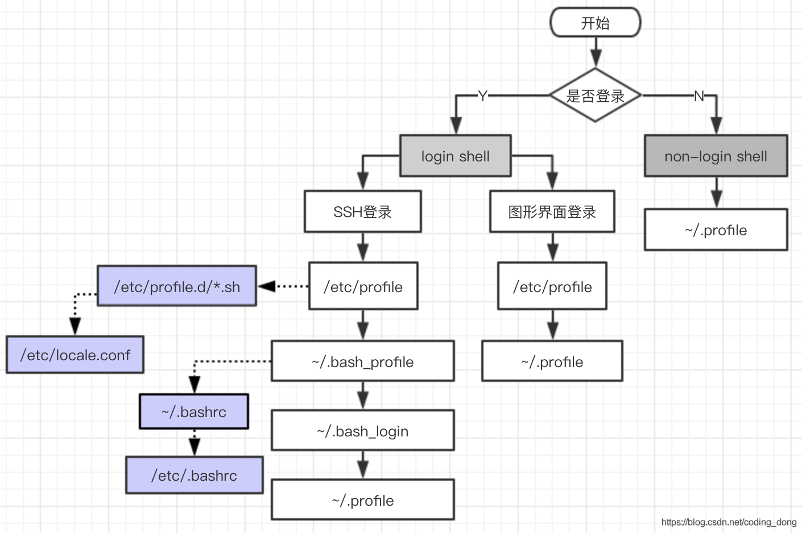

# Linux的学习

​	建立这个仓库是为了对Linux进行学习，以便以后搭框架使用。

## Linux架构设计

​	其实Linux系统的图形界面设计还是非常清晰的。如下图所示：


​	当结构清晰的时候，问题随之就会来，不知道你发现问题了没有?最大的问题就是从结构上看Linux 的图形界面效率肯定比 Windows的要差。因为Linux需要很多层的软件互相协作才能实现图形界面，而 Windows则相当直接，不拖泥带水的就搞定了图形界面。在计算机科学领域很少有实践结果与理论预期出现相反结论的情况，但是，可是，可但是，但可是……小概率事件还是会发生的，偏偏这个就是典型的一例。众所周知的Mac OS X的图形效果是目前任何操作系统都无法比拟的，自然也包括Windows 的任何版本。而Mac OS X是一种类Unix操作系统，采用的恰恰就是这种架构。只是 Mac OS X的“X协议”与Linux所采用的X协议有很大不同，前者是二进制的，后者使用的是纯文本。从纯粹学术理论上来讲，纯文本虽然在效率上会有些损失，但在其他方面会更具优势。

​	正因为Linux的图形界面得益于这种优良的架构设计，虽然在效率上不及 Mac OS X那样优秀，但是图像效果和功能的丰富程度绝对不会比 Windows差，至少它拥有很多种桌面环境可以选择，可以说每一种都会让你有完全不一样的体验。看惯了Windows的“老气横秋”，不妨去感受一下Linux的小清新吧!

## 常用基础命令


## Linux配置文件加载顺序

​	学习配置文件加载顺序是因为有一次linux编码不正确，修改了i18n文件和/etc/profile都没有作用，问了老大才知道linux有个配置文件加载顺序，就打算学习一下。

### shell启动类型

- **交互式登录**
  一个个地输入命令并及时查看它们的输出结果，整个过程都在跟 Shell 不停地互动。
- **交互式非登录**
  运行一个 Shell 脚本 文件，让所有命令批量化、一次性地执行。
- **非交互式登录**
  需要输入用户名和密码才能使用。
- **非交互式非登录**
  直接可以使用。

### 如何判断是否为交互式shell？

* 查看变量 PS1 是否为空，如果不为空，则是交互式，否则为非交互式

```shell
$ echo $PS1
```

### 如何判断是否为登录式shell？

* 取得 bash 是需要完整的登入流程，就称为 login shell，取得 bash 接口的方法不需要重复登入的操作就称为non-login shell。
  执行命令
  *  on 表示登录式（login shell），
  * off 表示非登录式（non-login shell）。

```shell
shopt login_shell
```

### 配置文件加载说明

* 对于登录式和非登录式，配置文件的加载顺序是不一样的。
  与 Bash Shell 有关的配置文件主要有以下几种，不同的启动方式会加载不同的配置文件。

```shell
1: /etc/profile           #对所有用户的登录shell都有效（全局配置文件），最好不要修改这个文件
2: ~/.bash_profile        #为当前用户设置环境信息，仅对当前用户的登录shell有效（局部配置文件）
3: ~/.bash_login 
4: ~/.profile
5: ~/.bashrc             #bash_profile只被登录shell读取并执行一次，
                         #如果在命令行上键入bash启动一个新的shell，这个新shell读取的是.bashrc而不是.bash_profile，
                         #将登录shell和运行一个子shell所需的配置文件分开可以获取非常灵活的配置策略，从而满足不同的场景。
6: /etc/bashrc
7: /etc/profile.d/*.sh
8: .bash_history	     #操作bash的历史记录
9: /etc/bashrc	         #和.bashrc的含义一样，只不过适用于所有的用户
```

### 启动顺序

#### login shell 启动顺序

* **/ect/profile** 文件是系统默认的主启动文件，系统上每个用户登录时都会执行。
* /etc/profile 文件有如下一段代码：

```
# 样例
for i in /etc/profile.d/*.sh /etc/profile.d/sh.local ; do
    if [ -r "$i" ]; then
        if [ "${-#*i}" != "$-" ]; then
            . "$i"
        else
            . "$i" >/dev/null
        fi
    fi
done

```

​	遍历 /etc/profile.d 目录下所有以 .sh 结尾的文件和 sh.local 文件。判断它们是否可读（[ -r "i &quot; ] ） ， 如 果 可 读 ， 判 断 当 前 Shell启 动 方 式 是 不 是 交 互 式 （ i&quot;]），如果可读，判断当前 Shell启动方式是不是交互式（i"]），如果可读，判断当前Shell启动方式是不是交互式（- 中包含 i）的，如果是交互式的，在当前 Shell 进程中执行该脚本（. “i &quot; ， s o u r c e &quot; i&quot;，source &quot;i"，source"i” 的简写， Shell 的模块化方式），否则，也在当前 Shell 进程中执行该脚本，只不过将输出重定向到了 /dev/null 中。
${-#*i} 这个表达式的意思是：从左向右，在 - 变量中找到第一个 i ，并截取 i 之后的子串。

#### 命令行与SSH登录

命令行登录和ssh登录，shell会按照以下顺序，运行第一个被找到的文件，余下的会被忽略：

```shell
/ect/profile
~/.bash_profile
~/.bash_login
~/.profile
# 一般没有 ~/.bashrc ，因为该文件一般通过其他文件运行。
```

不同的 Linux 发行版附带的个人配置文件也不同，有的可能只有其中一个，有的可能三者都有。如果三个文件同时存在的话，它们的优先级顺序是：

```shell
~/.bash_profile > ~/.bash_login > ~/.profile
```

如果 **~/.bash_profile** 存在，那么一切以该文件为准，并且到此结束，不再加载其它的配置文件。
如果 ~/.bash_profile 不存在，那么尝试加载 **/.bash_login**。/.bash_login 存在的话就到此结束，不存在的话就加载 **~/.profile**

#### 图形界面登录

只加载如下两个其他的会被忽略：

```shell
/ect/profile
~/.profile
```

#### no-login shell 启动顺序

图形界面打开的shell，只会读入**~/.bashrc** 文件，不会检查 /etc/.profile 等其他登录shell文件。

```shell
~/.bashrc
```


