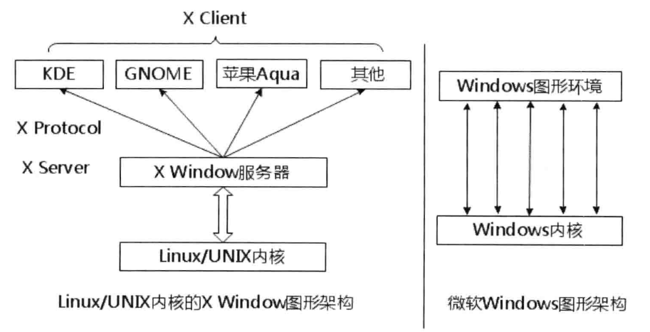
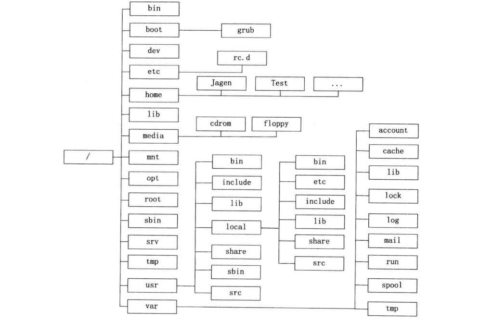
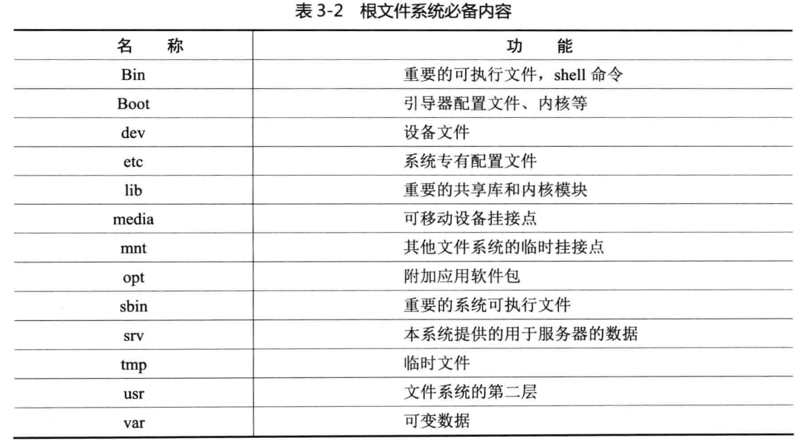
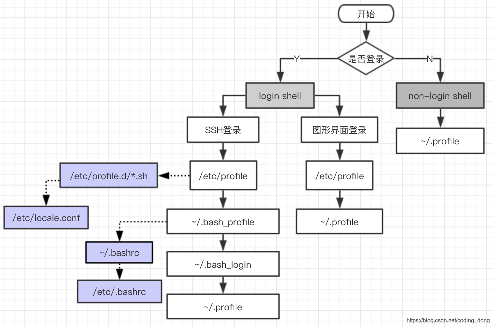

# Linux的学习

​	建立这个仓库是为了对Linux进行学习，以便以后搭框架使用。

## Linux架构设计

​	其实Linux系统的图形界面设计还是非常清晰的。如下图所示：



​	当结构清晰的时候，问题随之就会来，不知道你发现问题了没有?最大的问题就是从结构上看Linux 的图形界面效率肯定比 Windows的要差。因为Linux需要很多层的软件互相协作才能实现图形界面，而 Windows则相当直接，不拖泥带水的就搞定了图形界面。在计算机科学领域很少有实践结果与理论预期出现相反结论的情况，但是，可是，可但是，但可是……小概率事件还是会发生的，偏偏这个就是典型的一例。众所周知的Mac OS X的图形效果是目前任何操作系统都无法比拟的，自然也包括Windows 的任何版本。而Mac OS X是一种类Unix操作系统，采用的恰恰就是这种架构。只是 Mac OS X的“X协议”与Linux所采用的X协议有很大不同，前者是二进制的，后者使用的是纯文本。从纯粹学术理论上来讲，纯文本虽然在效率上会有些损失，但在其他方面会更具优势。

​	正因为Linux的图形界面得益于这种优良的架构设计，虽然在效率上不及 Mac OS X那样优秀，但是图像效果和功能的丰富程度绝对不会比 Windows差，至少它拥有很多种桌面环境可以选择，可以说每一种都会让你有完全不一样的体验。看惯了Windows的“老气横秋”，不妨去感受一下Linux的小清新吧!

## Linux文件组织结构

​	在详细讲述Linux的文件系统组织结构之前，我们先大体上看一下一个最小Linux系统的这棵“树”应该长什么样。如图所示:



​	再配上根目录下的文件夹具体作用：




## 常用基础命令

### 目录和文件处理

| 命令                                                         | 说明                                                         |
| ------------------------------------------------------------ | ------------------------------------------------------------ |
| 目录和文件处理：在讲解之前，我们先认识一下几个好玩的符号. ：小点活在当下，即当前目录。例如：./jie_work执行当前目录下的jie_work文件..：两点跑上去，既到当前的上一级目录。举个例子，命令cd..修改当前工作目录到上一级目录~ ：水波带我回家，即/home/我的登录名。例如我的登录名为zhangjie，cd ~命令就是cd /home/zhangjie。当然你直接输入cd，也有同样功效 |                                                              |
| mkdir                                                        | 建立目录用法：mkdir [OPTION] DIRECTORY…例：mkdir fangru      |
| ls                                                           | 列出目录下的内容用法：ls [OPTION]…[FILE]…例：ls -al fangru   |
| cd                                                           | 更换工作目录用法：cd [DIRECTORY]                            例：cd fangru |
| pwd                                                          | 显示当前工作目录用法：pwd                                    |
| vim                                                          | 增强版文本编辑器用法：vim [OPTION] [file] 例：vim helloworld.c |
| cp                                                           | 拷贝文件及其目录用法：cp [OPTION]... SOURCE DEST                                                                                    例：cp jie.txt jie.bak |
| mv                                                           | 移动（重命名）文件用法：mv [OPTION]…SOURCE DEST                                                         例：mv jieold jienew |
| rm                                                           | 删除文件或目录用法：rm [OPTION]…FILE…   例：rm -rf jie_dir   |
| find                                                         | 在目录及其子目录查找文件用法：find [OPTION] [path] [pattern]例：find -name jie*.txt |
| history                                                      | 显示最近使用过的命令用法：history                            |
| 文本处理：在讲解之前，有必要说明一下模式的定义。模式是一种表达式，不列出所有元素，而是给出一系列字符串的一种精确描述例如：ab*cd匹配了以ab开始和cd结束的一系列字符串 |                                                              |
| cat                                                          | 连结文件打印到标准输出用法：cat [OPTION] [FILE]…                                                                                 例：cat pic.png love.txt > pic1.png还记得那个命令行的故事吧？ |
| echo                                                         | 显示一行文本用法：echo [OPTION] [string]                例：echo $HOME |
| grep                                                         | 搜索特定的内容并将含有这些内容的行标准输出用法：grep [OPTION] PATTERN [FILE]例：                       grep -i Jagen magicLinux.txt |
| wc                                                           | 统计指定文件中的字节数、字数、行数,并将统计结果显示输出用法：wc [OPTION]…[FILE]例：                  wc -L magicLinux.txt |
| sort                                                         | 对文件中的各行进行排序用法：sort [OPTION]…[FILE]例：                                                                          sort -r magicLinux.txt |
| 系统管理：在讲解这类命令之前，先谈谈文件权限的定义。Linux系统上文件有三种权限-读、写和执行。敲入ls -l命令后，我们会发现有10个字母表示文件类型和权限信息：第一个字母是文件类型，d代表目录，-代表普通文件；接下了的每三个字母为一组，分别代表拥有者（owner）群组成员（groups）其他人（others）的读、写和执行权限。例：drwxrw-r--意味着这是一个目录，拥有者拥有读、写和执行三种权限，群组成员拥有读写权限，其他人只拥有可读权限。权限位还可以用相应的数值来代表，读-4、写-2、执行-1，这些数字或它们的和就代表一个角色的权限。例：rwxrw-r-- = 764673 = rw-rwx-wx |                                                              |
| chmod                                                        | 控制用户对文件的权限用法：chmod [OPTION] [MODE] [FILE]例：                                                    chmod 764 count.sh |
| chown                                                        | 改变档案的拥有者用法：chown [OPTION]…OWNER[:[GROUP]] FILE例：chown jie magicLinux.txt |
| su                                                           | su是切换到其他用户，但是不切换环境变量su - 是完整的切换到一个用户环境要知两者的区别，用export命令一查便知。用法：su [OPTION] [LOGIN]例：su zhangjie |
| passwd                                                       | 更改使用者的密码参数/etc/passwd存储的是操作系统用户信息，该文件为所有用户可见 /etc/shadow被称为/etc/passwd的影子文件。它们之间的内容是互补的。shadow内容包括用户及被加密的密码以及其它/etc/passwd不能包括的信息，比如用户的有效期限等 用法：passwd [OPTION]例：passwd zhangjie |
| who                                                          | 显示目前登入系统的用户信息用法：who [OPTION]例：who -b       |
| 进程管理                                                     |                                                              |
| ps                                                           | 强悍的进程查看命令用法：ps [OPTION]例：ps -aef               |
| kill                                                         | 删除执行中的程序或工作用法：kill [OPTION]例：kill -9 3154    |
| jobs                                                         | 通过jobs命令查到后台正在执行的命令的序号(非进程号pid)用法：jobs |
| bg                                                           | 指定号码（非进程号）的命令进程放到后台运行用法：输入'ctrl+z' 然后输入 'bg<job id>'例：bg <job id> |
| fg                                                           | 指定号码（非进程号）的命令进程放到前台运行用法：fg <jobid>   |
| 档案                                                         |                                                              |
| tar                                                          | 压缩和解压用法：tar [OPTION] DEST SOURCE例：tar -cvf /home/archive.tar（压缩）tar -xvf /home/archive.tar（解压） |
| zip                                                          | 打包压缩用法：zip [OPTION] DEST SOURSE例：zip original.zip original |
| unzip                                                        | 解压缩zip文件用法：unzip filename例：unzip original.zip      |
| 网络                                                         |                                                              |
| ssh                                                          | 远程登录的客户端用法：ssh [options] [user]@hostname例：ssh [zhangjie@10.105.11.20](mailto:guest@10.105.11.20) |
| scp                                                          | 基于ssh登陆进行安全的远程文件拷贝命令用法：scp [options] [[user]@host1:file1] [[user]@host2:file2]例：scp file1.txt zhangjie@10.105.11.20:~/work/ |
| 文件系统                                                     |                                                              |
| fdisk                                                        | 观察硬盘之实体使用情形与分割硬盘用用法：fdisk [options]例：sudo fdisk -l |
| mount                                                        | 如果你要使用储存设备(Mo、硬盘、光驱等)，就得先将它挂上(Mount)，而当储存设备挂上了之后，就可以把它当成一个目录来进行访问。挂上一个设备使用mount命令在使用mount这个指令时，至少要先知道下列三种信息：1. 要Mount对象的文件系统类型？2. 要Mount对象的设备名称?3. 要将设备Mount到哪个目录去？用法：mount -t type device dir例：mount /dev/sda5 /media/target |
| umount                                                       | 卸除文件系统用法：umount [OPTIONS] dir \| device例：umount /media/target |
| du                                                           | 查看目录或文件所占用磁盘空间的大小用法：du [OPTION]……[FILE]……例：du |
| df                                                           | 检查文件系统的磁盘空间占用情况。用法：df [OPTION]……[FILE]……例：df |
| quota                                                        | 显示磁盘使用情况和限制情况用法：quota [OPTION]例：quota -v   |
| 扩展                                                         |                                                              |
| reboot                                                       | 重启系统用法：reboot [OPTION]例：reboot                      |
| poweroff                                                     | 关闭系统用法：poweroff [OPTION]例：poweroff                  |
| sed                                                          | 一种在线编辑器，它一次处理一行内容用法：sed [OPTION] [input-file]例：sed 's/love/hate/g' loveletter.txt |
| awk                                                          | 一种文本处理工具，Linux及Unix环境中功能最强大的数据处理引擎之一。用法：awk [-F fs] [-v var=value] [-f progfile \| 'prog'] [file ……]例：awk '/^[ns]/{print $1}' test |

### 快捷键

| 常用快捷键             | 说明                                                         |
| ---------------------- | ------------------------------------------------------------ |
| <Tab>                  | 在文本终端下，使用TAB自动完成命令的输入，或者显示所有的可选项。超好用！ |
| <Shift><PgUp>          | 滚动文本终端输出。终端屏幕上一屏又一屏的提示信息，就可以用它向上翻滚查看这些信息 |
| <Shift><PgDown>        | 回滚文本终端输出                                             |
| <Ctrl><Alt><Delete>    | 文本终端下关机和重新启动                                     |
| <Ctrl><Alt><Backspace> | 关闭或重启X Window                                           |
| <Ctrl>a                | 到正在输入的命令行的首部                                     |
| <Ctrl>e                | 到正在输入的命令行的尾部                                     |
| <Ctrl>c                | 终止当前进程                                                 |
| <Ctrl>s                | 停止终端传输                                                 |
| <Ctrl>p                | 上一条执行的命令                                             |
| <Ctrl>n                | 下一条执行的命令，前提是执行过<Ctrl>p                        |
| <Ctrl>f                | 在当前命令输入中右移光标一个字符                             |
| <Ctrl>b                | 在当前命令输入中左移光标一个字符                             |
| <Alt>f                 | 在当前命令输入中右移光标一个词                               |
| <Alt>b                 | 在当前命令输入中左移光标一个词                               |
| <Ctrl>k                | 删除光标后的所有字符                                         |
| <Ctrl>d                | 删除光标当前的字符                                           |
| <Alt><Tab>             | 切换不同的程序窗口                                           |
| <Alt><F1>              | 访问“开始”菜单                                               |
| <Alt><鼠标左键>        | 拖曳并移动一个窗口                                           |
| <Alt><PrintScreen>     | 把当前屏幕的快照存到剪贴板                                   |
| <Ctrl><Alt><d>         | 哈哈，老板键。切换隐藏/显示桌面运行程序                      |
| <Alt><SysRq><key>      | 组合键主要是针对开发人员的程序调试目的或者在紧急场合下才使用。可以通过设置相对应的内核参数来激活或者取消。例如：echo "1" > /proc/sys/kernel/sysrq 激活这个组合命令 |
| <Alt><SysRq><s>        | 防止数据丢失，挂载的文件系统紧急同步把缓存写入硬盘           |
| ……                     | ……                                                           |
| <Alt><SysRq><o>        | 关机。下班了！                                               |

### 字符表

| 参数处理                      | 说明                                   |
| ----------------------------- | -------------------------------------- |
| [命令1];[命令2];[命令3]       | 一次运行多个命令                       |
| [命令1]&&[命令2]&&[命令3]     | 前一个命令执行成功才执行下一个命令     |
| [命令1]\|\|[命令2]\|\|[命令3] | 如果前一个命令执行失败才执行下一个命令 |
|                               |                                        |

| 参数处理 | 说明                                                         |
| -------- | ------------------------------------------------------------ |
| $#       | 传递到脚本或函数的参数个数                                   |
| $0       | 脚本本身的名字                                               |
| $1       | 传递给该shell脚本的第一个参数                                |
| $2       | 传递给该shell脚本的第二个参数                                |
| $@       | 传给脚本的所有参数的列表                                     |
| $*       | 是以一个单字符串显示所有向脚本传递的参数，与位置变量不同，参数可超过``9``个 |
| $$       | 是脚本运行的当前进程ID号                                     |
| $?       | 显示最后命令的退出状态                                       |
|          |                                                              |

## Linux配置文件加载顺序

​	学习配置文件加载顺序是因为有一次linux编码不正确，修改了i18n文件和/etc/profile都没有作用，问了老大才知道linux有个配置文件加载顺序，就打算学习一下。

​	使用locale可以查看字符集编码

### shell启动类型

- **交互式登录**
  一个个地输入命令并及时查看它们的输出结果，整个过程都在跟 Shell 不停地互动。
- **交互式非登录**
  运行一个 Shell 脚本 文件，让所有命令批量化、一次性地执行。
- **非交互式登录**
  需要输入用户名和密码才能使用。
- **非交互式非登录**
  直接可以使用。

### 如何判断是否为交互式shell？

* 查看变量 PS1 是否为空，如果不为空，则是交互式，否则为非交互式

```shell
$ echo $PS1
```

### 如何判断是否为登录式shell？

* 取得 bash 是需要完整的登入流程，就称为 login shell，取得 bash 接口的方法不需要重复登入的操作就称为non-login shell。
  执行命令
  *  on 表示登录式（login shell），
  * off 表示非登录式（non-login shell）。

```shell
shopt login_shell
```

### 配置文件加载说明

* 对于登录式和非登录式，配置文件的加载顺序是不一样的。
  与 Bash Shell 有关的配置文件主要有以下几种，不同的启动方式会加载不同的配置文件。

```shell
1: /etc/profile           #对所有用户的登录shell都有效（全局配置文件），最好不要修改这个文件
2: ~/.bash_profile        #为当前用户设置环境信息，仅对当前用户的登录shell有效（局部配置文件）
3: ~/.bash_login 
4: ~/.profile
5: ~/.bashrc             #bash_profile只被登录shell读取并执行一次，
                         #如果在命令行上键入bash启动一个新的shell，这个新shell读取的是.bashrc而不是.bash_profile，
                         #将登录shell和运行一个子shell所需的配置文件分开可以获取非常灵活的配置策略，从而满足不同的场景。
6: /etc/bashrc
7: /etc/profile.d/*.sh
8: .bash_history	     #操作bash的历史记录
9: /etc/bashrc	         #和.bashrc的含义一样，只不过适用于所有的用户
```

### 启动顺序

#### login shell 启动顺序

* **/ect/profile** 文件是系统默认的主启动文件，系统上每个用户登录时都会执行。
* /etc/profile 文件有如下一段代码：

```
# 样例
for i in /etc/profile.d/*.sh /etc/profile.d/sh.local ; do
    if [ -r "$i" ]; then
        if [ "${-#*i}" != "$-" ]; then
            . "$i"
        else
            . "$i" >/dev/null
        fi
    fi
done

```

​	遍历 /etc/profile.d 目录下所有以 .sh 结尾的文件和 sh.local 文件。判断它们是否可读（[ -r "i &quot; ] ） ， 如 果 可 读 ， 判 断 当 前 Shell启 动 方 式 是 不 是 交 互 式 （ i&quot;]），如果可读，判断当前 Shell启动方式是不是交互式（i"]），如果可读，判断当前Shell启动方式是不是交互式（- 中包含 i）的，如果是交互式的，在当前 Shell 进程中执行该脚本（. “i &quot; ， s o u r c e &quot; i&quot;，source &quot;i"，source"i” 的简写， Shell 的模块化方式），否则，也在当前 Shell 进程中执行该脚本，只不过将输出重定向到了 /dev/null 中。
${-#*i} 这个表达式的意思是：从左向右，在 - 变量中找到第一个 i ，并截取 i 之后的子串。

#### 命令行与SSH登录

命令行登录和ssh登录，shell会按照以下顺序，运行第一个被找到的文件，余下的会被忽略：

```shell
/ect/profile
~/.bash_profile
~/.bash_login
~/.profile
# 一般没有 ~/.bashrc ，因为该文件一般通过其他文件运行。
```

不同的 Linux 发行版附带的个人配置文件也不同，有的可能只有其中一个，有的可能三者都有。如果三个文件同时存在的话，它们的优先级顺序是：

```shell
~/.bash_profile > ~/.bash_login > ~/.profile
```

如果 **~/.bash_profile** 存在，那么一切以该文件为准，并且到此结束，不再加载其它的配置文件。
如果 ~/.bash_profile 不存在，那么尝试加载 **/.bash_login**。/.bash_login 存在的话就到此结束，不存在的话就加载 **~/.profile**

#### 图形界面登录

只加载如下两个其他的会被忽略：

```shell
/ect/profile
~/.profile
```

#### no-login shell 启动顺序

图形界面打开的shell，只会读入**~/.bashrc** 文件，不会检查 /etc/.profile 等其他登录shell文件。

```shell
~/.bashrc
```



